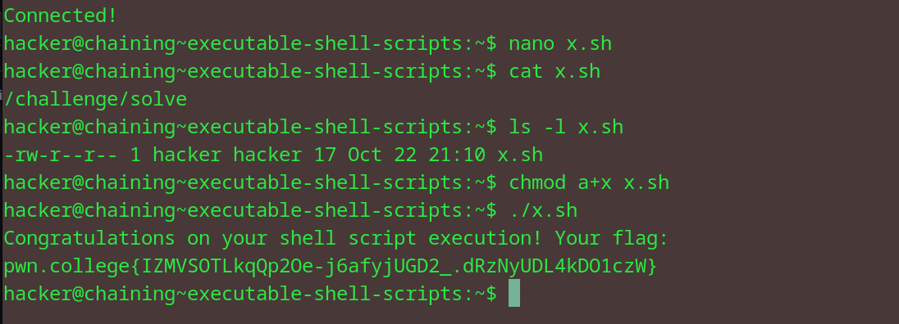

# Executable Shell Scripts
## Question
Try that here! Make a shellscript that will invoke /challenge/solve, make it executable, and run it without explicitly invoking bash!

## Solution

1. edit the contents of the shell script to only contain the /challenge/solve command 
2. checked and edited the perms of the x.sh file, giving it exec permission
3. ran the file to get the flag

flag: pwn.college{IZMVSOTLkqQp2Oe-j6afyjUGD2_.dRzNyUDL4kDO1czW}

