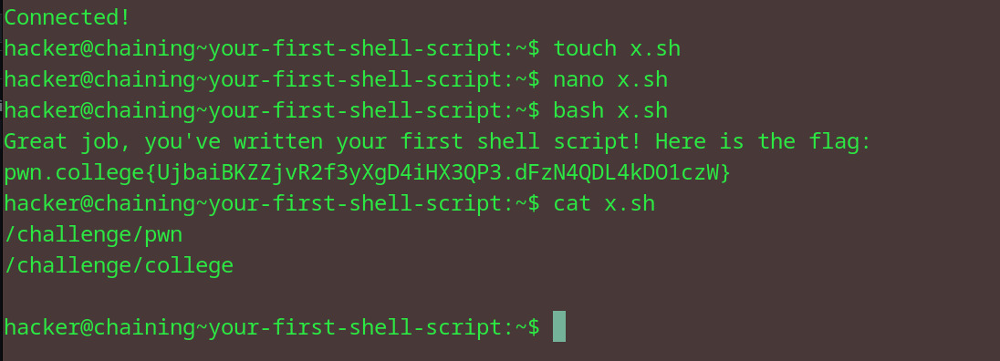

# Your First Shell Script
## Question
Now, it's your turn! Same as last level, run /challenge/pwn and then /challenge/college, but this time in a shell script called x.sh, then run it with bash!

## Solution

1. create a file named x.sh and use nano to edit the contents of the file (learnt from Bandit)
2. wrote both the given commands in two lines in the shell
3. run the shell script using bash to get flag
4. also read the contents of the nano file, just 'cause

flag: pwn.college{UjbaiBKZZjvR2f3yXgD4iHX3QP3.dFzN4QDL4kDO1czW}

