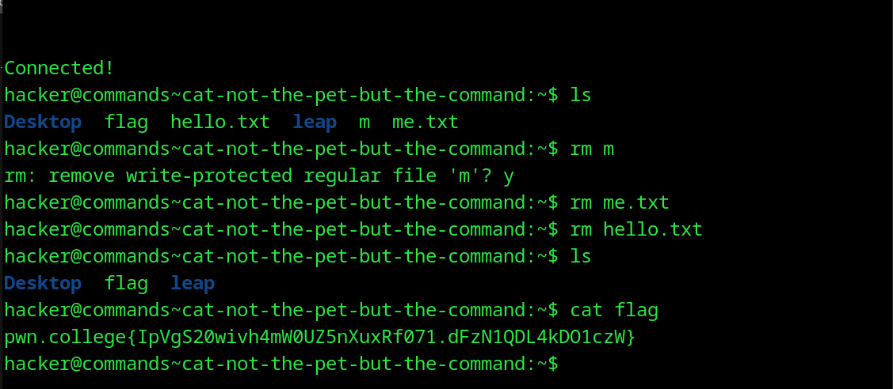

# Cat: not the pet but the command
## Question
In this challenge, I will copy the flag to the flag file in your home directory (where your shell starts). Go read it with cat!

## Solution

1. ls in the ~ directory to see the flag file
2. found some irrelevant files i made before so i removed them
3. cat flag file to find flag

flag: pwn.college{IpVgS20wivh4mW0UZ5nXuxRf071.dFzN1QDL4kDO1czW}
