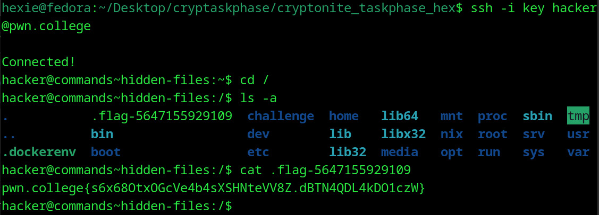

# Hidden Files
## Question
Now, it's your turn! Go find the flag, hidden as a dot-prepended file in /.

## Solution

1. cd into the / dir and ran the hidden file finding command
2. cat the hidden file and got the flag

flag: pwn.college{s6x68OtxOGcVe4b4sXSHNteVV8Z.dBTN4QDL4kDO1czW}
