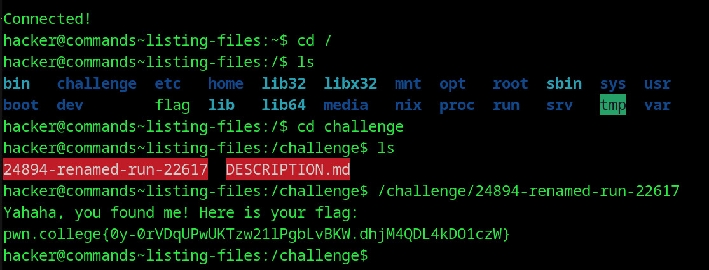

# Listing Files
## Question
In this challenge, we've named /challenge/run with some random name! List the files in /challenge to find it.

## Solution

1. cd into the / dir and ls to look for the challenge directory
2. ls to find the random named exe file and executed it to find the required flag

flag: pwn.college{0y-0rVDqUPwUKTzw21lPgbLvBKW.dhjM4QDL4kDO1czW}
