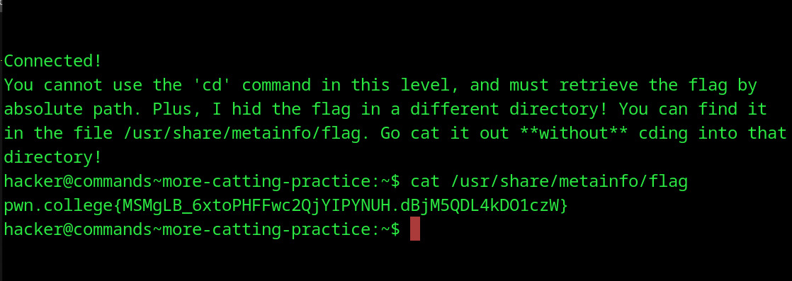

#  More Catting Practice
## Question
You can specify all sorts of paths as arguments to commands, and we'll practice some more with cat. In this level, I'll put the flag in some crazy directory, and I will not allow you to change directories with cd, so no cat flag for you. You must retrieve the flag by absolute path, wherever it is.

## Solution

1. description was given so i just cat the flag from the given path

flag: pwn.college{MSMgLB_6xtoPHFFwc2QjYIPYNUH.dBjM5QDL4kDO1czW}
