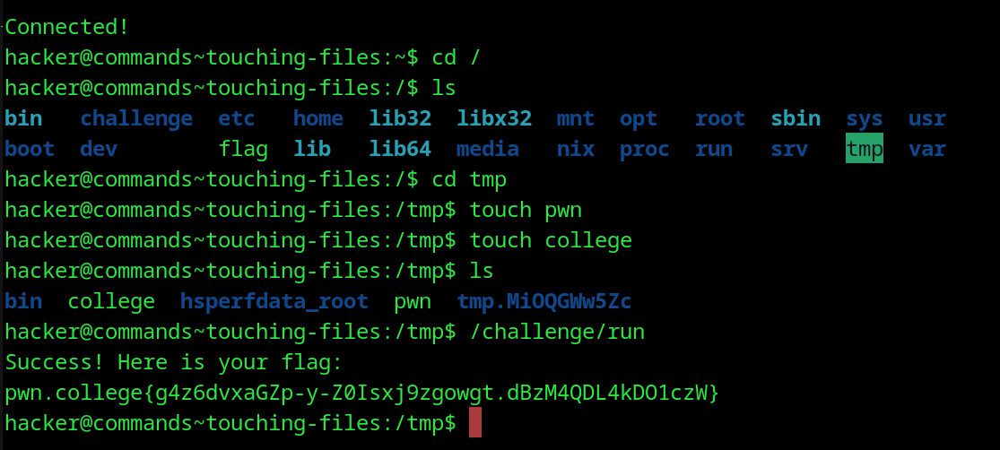

# Touching Files
## Question
It's that simple! In this level, please create two files: /tmp/pwn and /tmp/college, and run /challenge/run to get your flag!

## Solution

1. cd into the / dir and then into the tmp folder
2. made two files 'pwn'and 'college'
3. checked to see if they were present
4. ran required cmd

flag: pwn.college{g4z6dvxaGZp-y-Z0Isxj9zgowgt.dBzM4QDL4kDO1czW}
