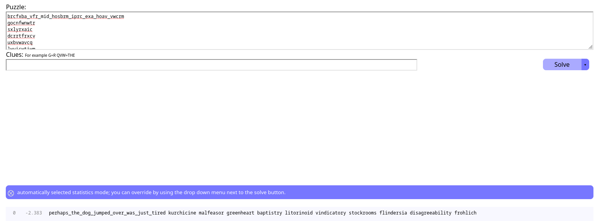

# spelling quiz
I found the flag, but my brother wrote a program to encrypt all his text files. He has a spelling quiz study guide too, but I don't know if that helps.
files:
1. flag.txt ("brcfxba_vfr_mid_hosbrm_iprc_exa_hoav_vwcrm")
2. study-guide.txt (a list of encoded words)
3. encrypt.py

## Approach
> brcfxba_vfr_mid_hosbrm_iprc_exa_hoav_vwcrm
I put this flag into quipqiup.com and got nothing comprehensible. My second approach was to also put in some of the study guide words in with the flag, to help the decoder along. Thankfully, this worked.
This is the output I got: 

### flag: picoCTF{perhaps_the_dog_jumped_over_was_just_tired}
