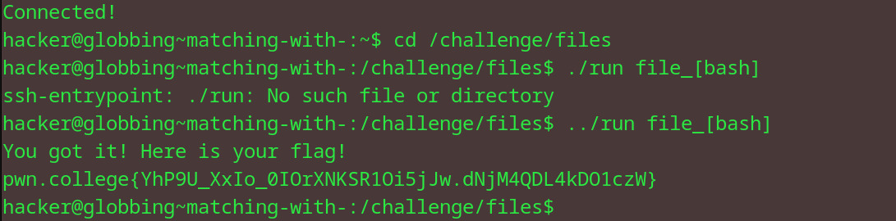

# Matching with []
## Question
Try it here! We've placed a bunch of files in /challenge/files. Change your working directory to /challenge/files and run /challenge/run with a single argument that bracket-globs into file_b, file_a, file_s, and file_h!

## Solution

1. went to the dir as instructed
2. ran the run file using ../ and used the arg bash as it corresponds to the file names given in the question

flag: pwn.college{YhP9U_XxIo_0IOrXNKSR1Oi5jJw.dNjM4QDL4kDO1czW}
