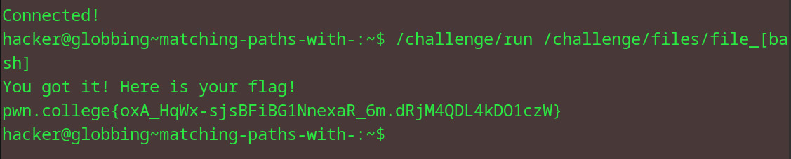

# Matching paths with []
## Question
Now it's your turn. Once more, we've placed a bunch of files in /challenge/files. Starting from your home directory, run /challenge/run with a single argument that bracket-globs into the absolute paths to the file_b, file_a, file_s, and file_h files!

## Solution

1. same as the brackets question except i ran the files command remotely from the home dir instead of moving into the files dir
2. same technique of using 'bash' as the arg as per the instructed file names

flag: pwn.college{oxA_HqWx-sjsBFiBG1NnexaR_6m.dRjM4QDL4kDO1czW}
