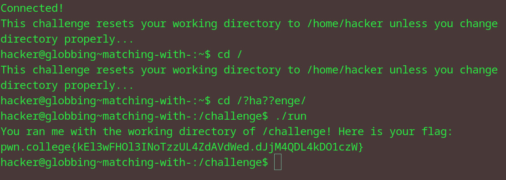

# Matching with ?
## Question
Starting from your home directory, change your directory to /challenge, but use the ? character instead of c and l in the argument to cd! Once you're there, run /challenge/run for the flag!

## Solution

1. accidentally did cd into /, forgot the question
2. used ? to replace the given characters in the question
3. ran run file with ./ to get flag

flag: pwn.college{kEl3wFHOl3INoTzzUL4ZdAVdWed.dJjM4QDL4kDO1czW}
