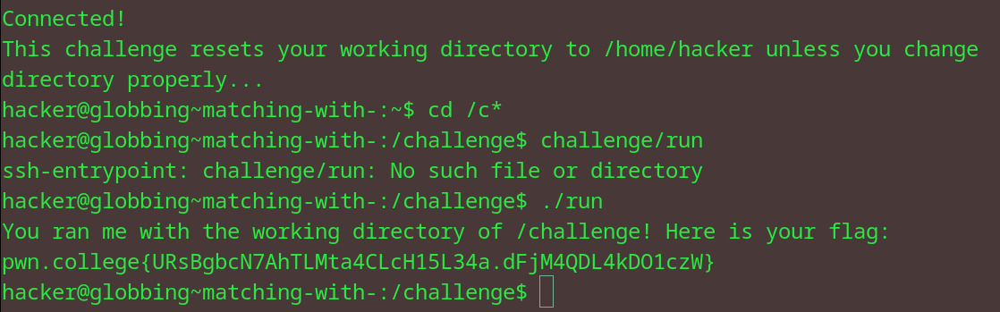

# Matching with *
## Question
Starting from your home directory, change your directory to /challenge, but use globbing to keep the argument you pass to cd to at most four characters! Once you're there, run /challenge/run for the flag!

## Solution

1. cd into the required directory by using * to complete the name
2. ran the run file using ./ 

flag: pwn.college{URsBgbcN7AhTLMta4CLcH15L34a.dFjM4QDL4kDO1czW}
