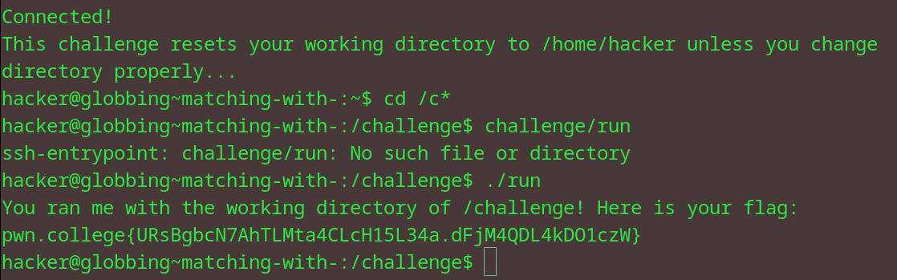

# Redirecting Output
## Question
In this challenge, you must use this input redirection to write the word PWN (all uppercase) to the filename COLLEGE (all uppercase).

## Solution

1. echoed the pwn filename to college as instructed 
2. got flag

flag: pwn.college{Ycqu423TYrEv14OVEx5iBLtq2u3.dRjN1QDL4kDO1czW}
