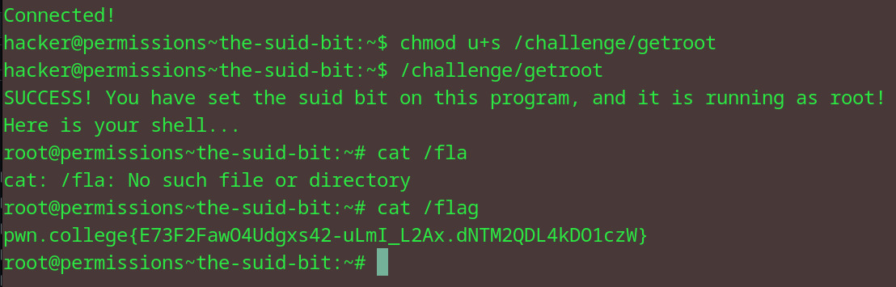

# The SUID Bit
## Question
In this challenge, you must retrieve the exit code returned by /challenge/get-code and then run /challenge/submit-code with that error code as an argument. Good luck!

## Solution

1. chmod'd the /challenge/getroot file to make it a SUID bit
2. ran the file 
3. once i was in the shell, i cat the file to find the final flag 

flag: pwn.college{E73F2FawO4Udgxs42-uLmI_L2Ax.dNTM2QDL4kDO1czW}
