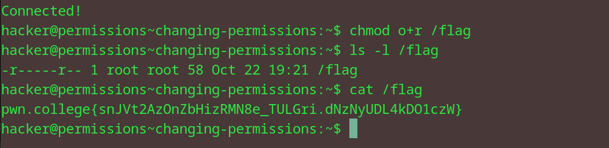

# Changing Permissions
## Question
In this challenge, you must retrieve the exit code returned by /challenge/get-code and then run /challenge/submit-code with that error code as an argument. Good luck!

## Solution

1. gave the other group read perms for the flag file
2. used ls -l to see the perms on the file
3. cat the flag

flag: pwn.college{snJVt2AzOnZbHizRMN8e_TULGri.dNzNyUDL4kDO1czW}
