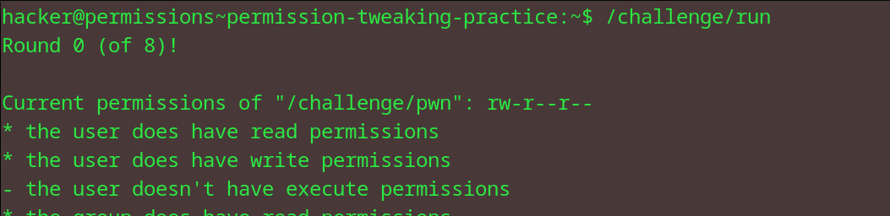
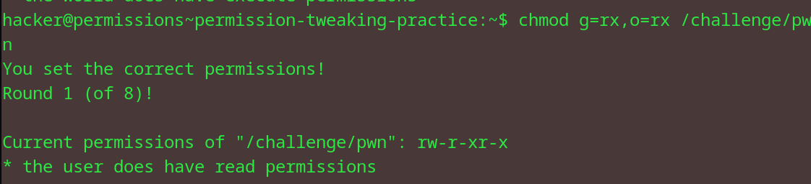
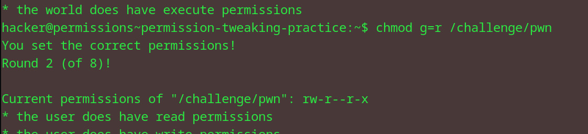
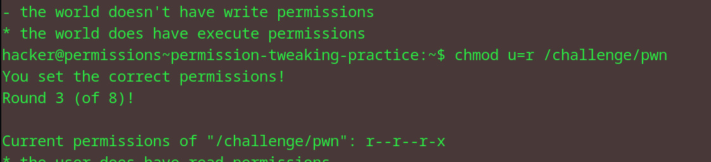
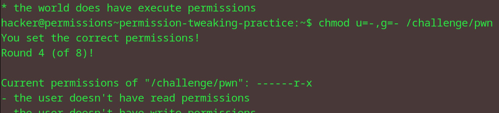
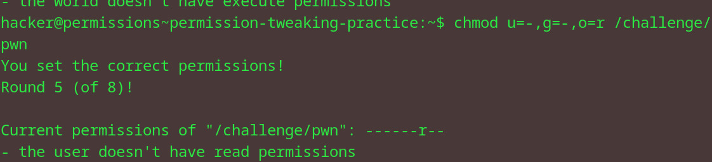
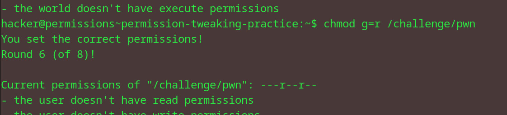
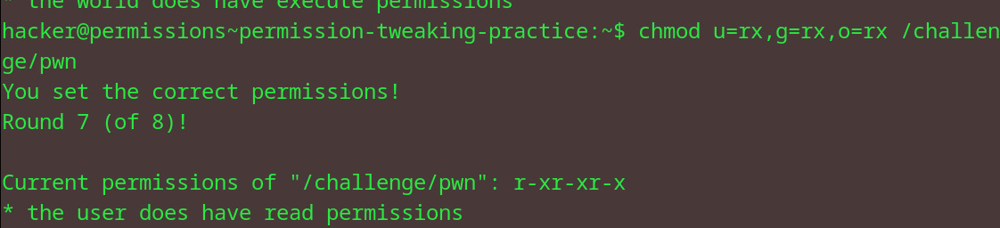
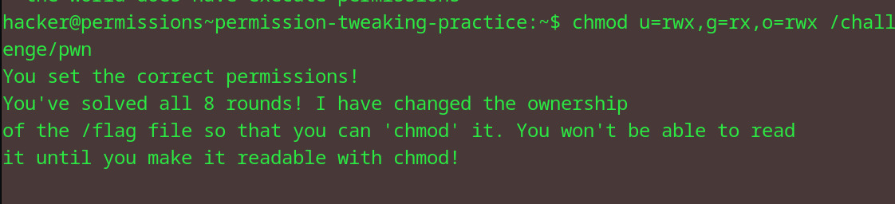

# Permission Tweaking Practice
## Question
In this challenge, you must retrieve the exit code returned by /challenge/get-code and then run /challenge/submit-code with that error code as an argument. Good luck!

## Solution

1. used chmod with all three groups: admin (u), groups (g), others (o) over 8 rounds of trials
2. finally used a+r to make the flag readable for everyone
3. cat the file to find the flag

flag: pwn.college{EmyYHtUVLhvToy2COjjVTnzhQYy.dBTM2QDL4kDO1czW}
