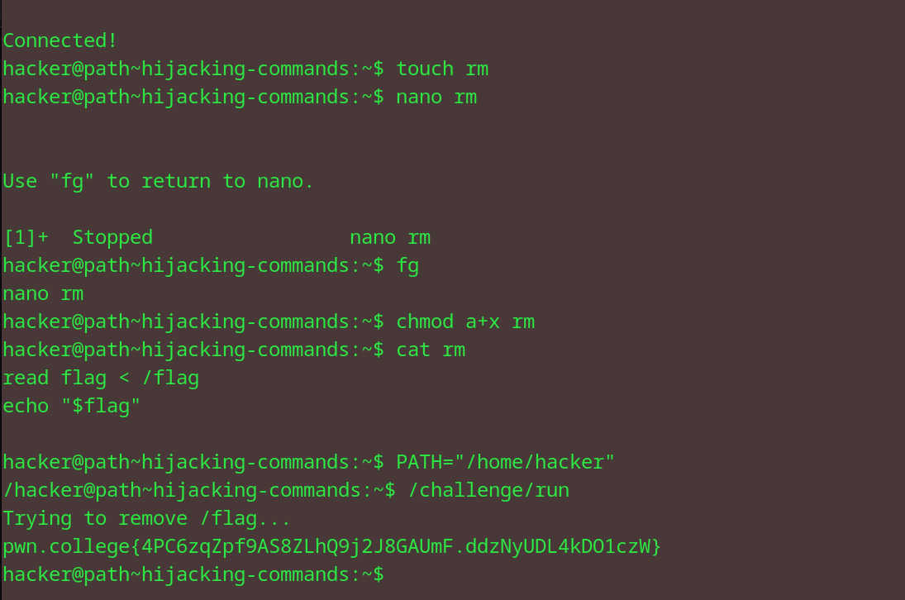

# Hijacking Commands
## Question
Armed with your knowledge, you can now carry out some shenanigans. This challenge is almost the same as the first challenge in this module. Again, this challenge will delete the flag using the rm command. But unlike before, it will not print anything out for you.

## Solution

1. as instructed in the question, we hijack the functionality of the rm command 
2. used nano to write the same script as the last question
3. chmod to make the file executable for everyone 
4. set the path as /home/hacker and run the file

flag: pwn.college{4PC6zqZpf9AS8ZLhQ9j2J8GAUmF.ddzNyUDL4kDO1czW}

