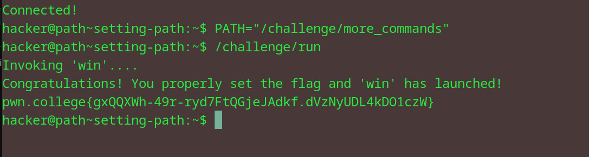

# Setting PATH
## Question
Let's practice. This level's /challenge/run will run the win command via its bare name, but this command exists in the /challenge/more_commands/ directory, which is not initially in the PATH. The win command is the only thing that /challenge/run needs, so you can just overwrite PATH with that one directory. Good luck!

## Solution

1. as instructed in the question, set the path to /challenge/more_commands
2. as the win condition exists in this dir, we can run /challenge/run
3. obtain flag

flag: pwn.college{gxQQXWh-49r-ryd7FtQGjeJAdkf.dVzNyUDL4kDO1czW}

