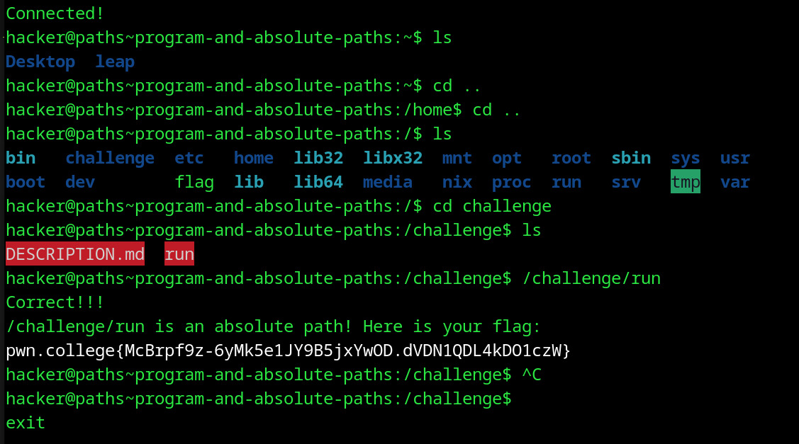

# AbsolutePaths
## Question
This challenge again requires you to execute it by invoking its absolute path. You'll want to execute the run file that is in the challenge directory that is, in turn, in the / directory. If you invoke the challenge correctly, it will give you the flag. Good luck!

## Solution

1. moved to / folder
2. looked into the folder and followed instructions to run the exe file called /challenge/run

flag: pwn.college{McBrpf9z-6yMk5e1JY9B5jxYwOD.dVDN1QDL4kDO1czW}
