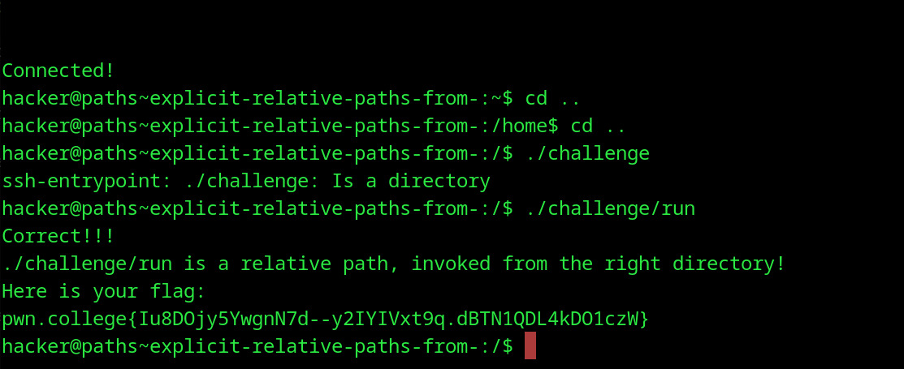

# Explicit Relative Paths, from /
## Question
This challenge will get you using . in your relative paths. Get ready!

## Solution

1. moved to / folder
2. ran ./challenge but that was a directory
3. changed the command to make it a relative path invoked from the right directory

flag: pwn.college{Iu8DOjy5YwgnN7d--y2IYIVxt9q.dBTN1QDL4kDO1czW}
