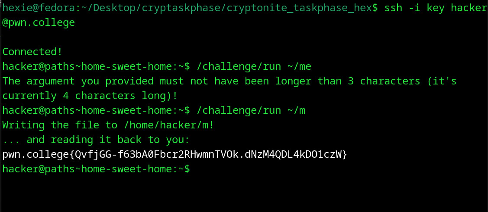

# Home Sweet Home
## Question
Now it's your turn to play! In this challenge, /challenge/run will write a copy of the flag to any file you specify as an argument on the commandline, with these constraints:

   1. Your argument must be an absolute path.
   2. The path must be inside your home directory.
   3. Before expansion, your argument must be three characters or less.

## Solution

1. ran the /challenge/run since i already knew where it was 
2. ran it with the arg ~/me because i thought 3 characters meant only the part after the forward slash
3. ran the command with argument ~/m and got flag

flag: pwn.college{QvfjGG-f63bA0Fbcr2RHwmnTVOk.dNzM4QDL4kDO1czW}
