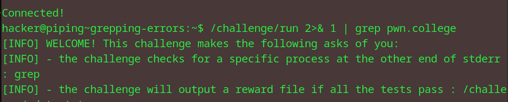
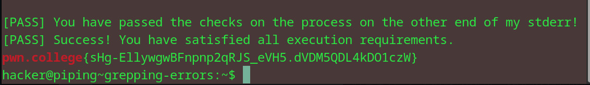

# Grepping errors
## Question
Try it now! Like the last level, this level will overwhelm you with output, but this time on standard error. Grep through it to find the flag!

## Solution

1. used the >& operator to redirect the standard error to standard output
2. also used the grep command to get the pwn.college text

flag: pwn.college{sHg-EllywgwBFnpnp2qRJS_eVH5.dVDM5QDL4kDO1czW}
