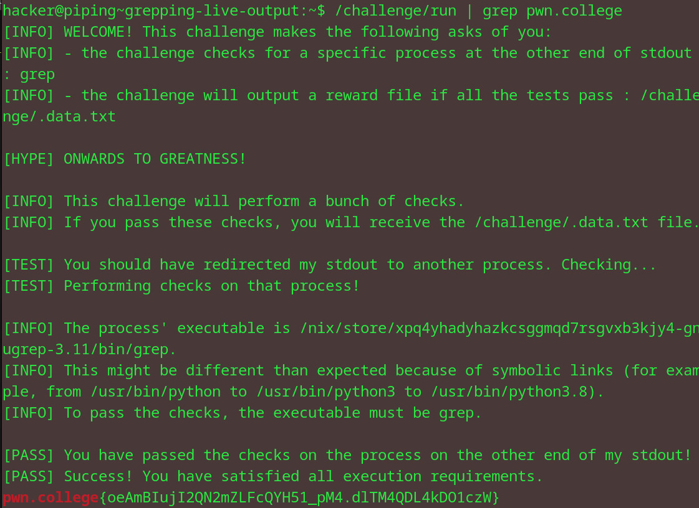

# Grepping live output
## Question
Now try it for yourself! /challenge/run will output a hundred thousand lines of text, including the flag. Grep for the flag!

## Solution

1. used piping to redirect the output of /challenge/run and simultaneously ran the grep command on it using the pwn.college argument
2. got flag at the end of a block of text

flag: pwn.college{oeAmBIujI2QN2mZLFcQYH51_pM4.dlTM4QDL4kDO1czW}
