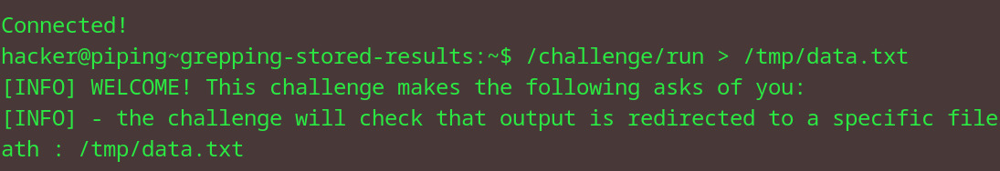
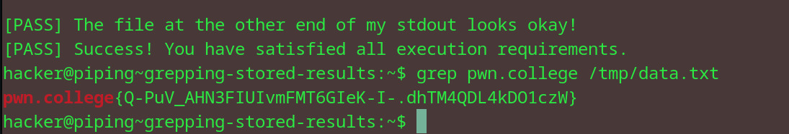

# Grepping stored results
## Question
   1. Redirect the output of /challenge/run to /tmp/data.txt.
   2. This will result in a hundred thousand lines of text, with one of them being the flag, in /tmp/data.txt.
   3. Grep that for the flag!

## Solution

1. redirected the output into a file into the tmp dir
2. grepped with the pwn.college arg to get the flag

flag: pwn.college{Q-PuV_AHN3FIUIvmFMT6GIeK-I-.dhTM4QDL4kDO1czW}
