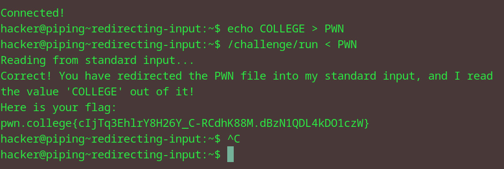

# Redirecting input
## Question
In this level, we will practice using /challenge/run, which will require you to redirect the PWN file to it and have the PWN file contain the value COLLEGE! To write that value to the PWN file, recall the prior challenge on output redirection from echo!

## Solution

1. echoed college into pwn
2. then echoed the pwn into the /challenge/run file
3. got flag

flag: pwn.college{cIjTq3EhlrY8H26Y_C-RCdhK88M.dBzN1QDL4kDO1czW}
