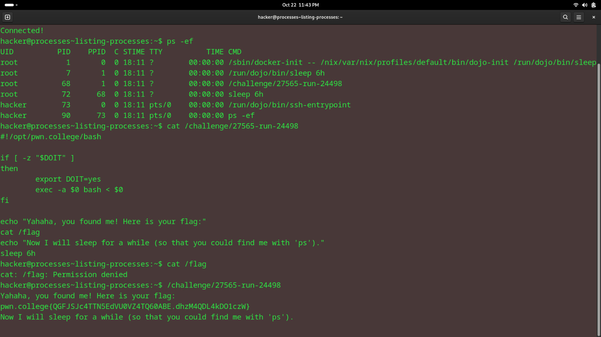

# Listing Processes
## Question
In this level, I have once again renamed /challenge/run to a random filename, and this time made it so that you cannot ls the /challenge directory! But I also launched it, so can find it in the running process list, figure out the filename, and relaunch it directly for the flag! Good luck!

## Solution

followed the instructions given in the question using the ps -ef

flag: pwn.college{QGFJSJc4TTN5EdVU0VZ4TQ60ABE.dhzM4QDL4kDO1czW}
