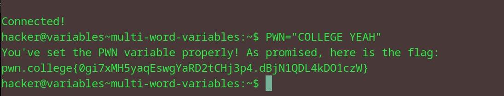

# Multi-word Variables
## Question
Here, the shell reads 1337 SAUCE as a single token, and happily sets that value to VAR. In this level, you'll need to set the variable PWN to COLLEGE YEAH. Good luck!

## Solution

followed instructions from the question

flag: pwn.college{0gi7xMH5yaqEswgYaRD2tCHj3p4.dBjN1QDL4kDO1czW}
