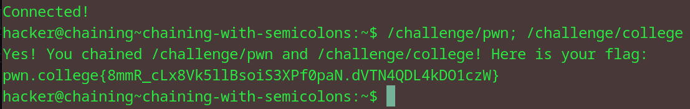

# Chaining with Semi-Colons
## Question
Give it a try now! In this level, you must run /challenge/pwn and then /challenge/college, chaining them with a semicolon.

## Solution

1. as instructed in the question, we chain the two commands with a semi colon 
2. run the command to obtain the flag

flag: pwn.college{8mmR_cLx8Vk5llBsoiS3XPf0paN.dVTN4QDL4kDO1czW}

