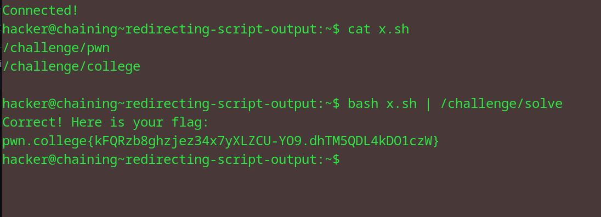

# Redirecting Script Output
## Question
In this level, we will practice piping (|) from your script to another program. Like before, you need to create a script that calls the /challenge/pwn command followed by the /challenge/college command, and pipe the output of the script into a single invocation of the /challenge/solve command!

## Solution

1. reusing the same nano shell script with the two commands one after another
2. run bash and pipe the output into the /challenge/solve file 
3. obtain flag

flag: pwn.college{kFQRzb8ghzjez34x7yXLZCU-YO9.dhTM5QDL4kDO1czW}

