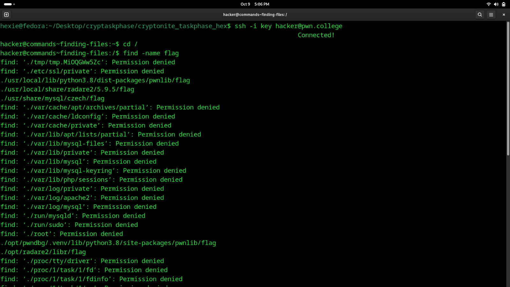

# Finding Files
## Question
Now it's your turn. I've hidden the flag in a random directory on the filesystem. It's still called flag. Go find it!


## Solution


1. used the name argument on the find command to find the flag
2. got a lot of permission denied files but i picked out the ones that i was allowed access to
3. 
``` bash
locations:
./usr/local/lib/python3.8/dist-packages/pwnlib/flag
./usr/local/share/radare2/5.9.5/flag
./usr/share/mysql/czech/flag
./opt/pwndbg/.venv/lib/python3.8/site-packages/pwnlib/flag
./opt/radare2/libr/flag
./nix/store/1yagn5s8sf7kcs2hkccgf8d0wxlrv5sz-radare2-5.9.0/share/radare2/5.9.0/flag
./nix/store/pmvk2bk4p550w182rjfm529kfqddnvh3-python3.11-pwntools-4.12.0/lib/python3.11/site-packages/pwnlib/flag
```
4. after exploring the first two i realized that they were directories and not files so i moved onto the third with the ls command (treating it as a directory)
5. it returned a path which means that it was a file not a directory
6. cat that file and found the flag

flag: pwn.college{UPwUZAMqed7Ws5IvFtWlX5S9wlC.dJzM4QDL4kDO1czW}
