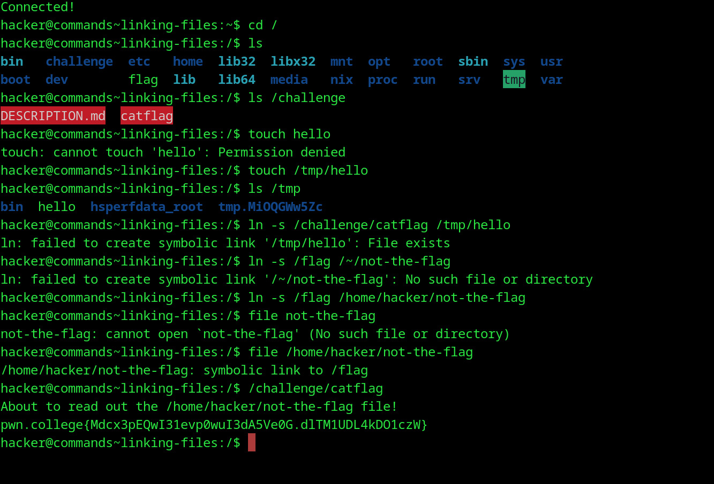

# Linking Files
## Question
Okay, now you try it! In this level the flag is, as always, in /flag, but /challenge/catflag will instead read out /home/hacker/not-the-flag. Use the symlink, and fool it into giving you the flag!

## Solution

1. ls into the /challenge dir to find the catflag exe 
2. tried linking it to a random file that i created in the tmp dir
3. didnt work so i tried linking it to the ~ dir which i expanded to /home/hacker in the next line so it would work
4. accessed it but used the ~ directory and file command 
5. got flag

flag: pwn.college{Mdcx3pEQwI31evp0wuI3dA5Ve0G.dlTM1UDL4kDO1czW}
