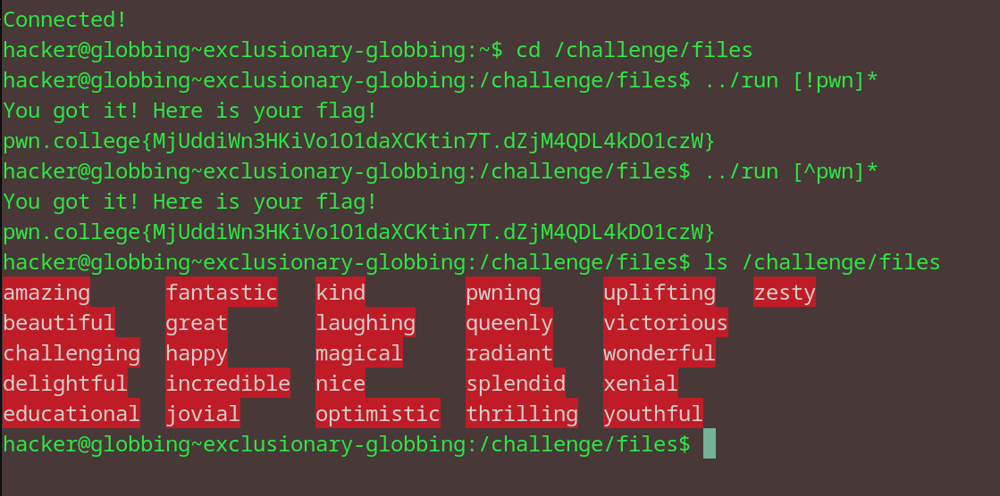

# Exclusionary Globbing
## Question
Armed with this knowledge, go forth to /challenge/files and run /challenge/run with all files that don't start with p, w, or n!

## Solution

1. ../run with two separate argumements 
2. arg1: with ! mark and the letters pwn
3. arg2: with ^ and the same letters

flag: pwn.college{MjUddiWn3HKiVo1O1daXCKtin7T.dZjM4QDL4kDO1czW}
