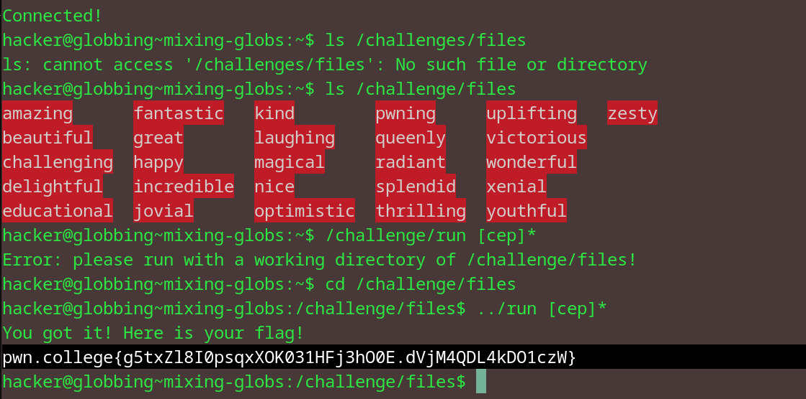

# Mixing Globs
## Question
Now, let's put the previous levels together! We put a few happy, but diversely-named files in /challenge/files. Go cd there and, using the globbing you've learned, write a single, short (6 characters or less) glob that will match the files "challenging", "educational", and "pwning"!

## Solution

1. ran ls on the given dir to see the contents (curiosity)
2. found that every file had a unique starting letter
3. using the match with [] concept + the * concept, i got the given arg of [cep]*

flag: pwn.college{g5txZl8I0psqxXOK031HFj3hO0E.dVjM4QDL4kDO1czW}
