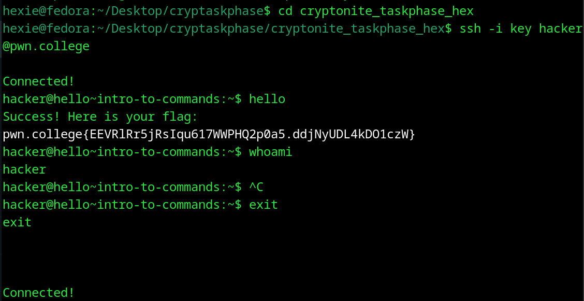

# Intro to Commands
## Question
In this challenge, you will invoke your first command! When you type a command and hit enter, the command will be invoked, as so:
```bash
hacker@dojo:~$ whoami
hacker
hacker@dojo:~$
```
Here, the user executed the whoami command, which simply prints the username (hacker) to the terminal. When the command terminates, the shell once again displays the prompt, ready for the next command.

In this level, invoke the hello command to get the flag! Keep in mind: commands in Linux are case sensitive: hello is different from HELLO.

## Solution

1. used ssh to access the question 
2. followed instructions to enter the hello command

flag: pwn.college{EEVRlRr5jRsIqu617WWPHQ2p0a5.ddjNyUDL4kD01czw}
