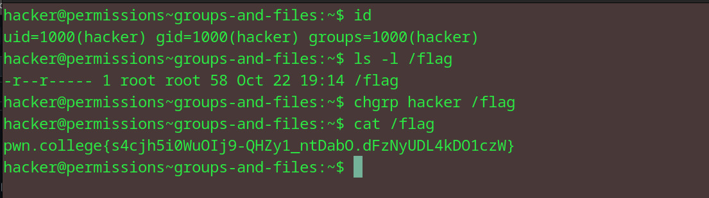

# Groups and Files
## Question
In this challenge, you must retrieve the exit code returned by /challenge/get-code and then run /challenge/submit-code with that error code as an argument. Good luck!

## Solution

1. make the hacker group the owner of the flag file 
2. make sure i can access the file using ls -l 
3. cat the flag file

flag: pwn.college{s4cjh5i0WuOIj9-QHZy1_ntDabO.dFzNyUDL4kDO1czW}
