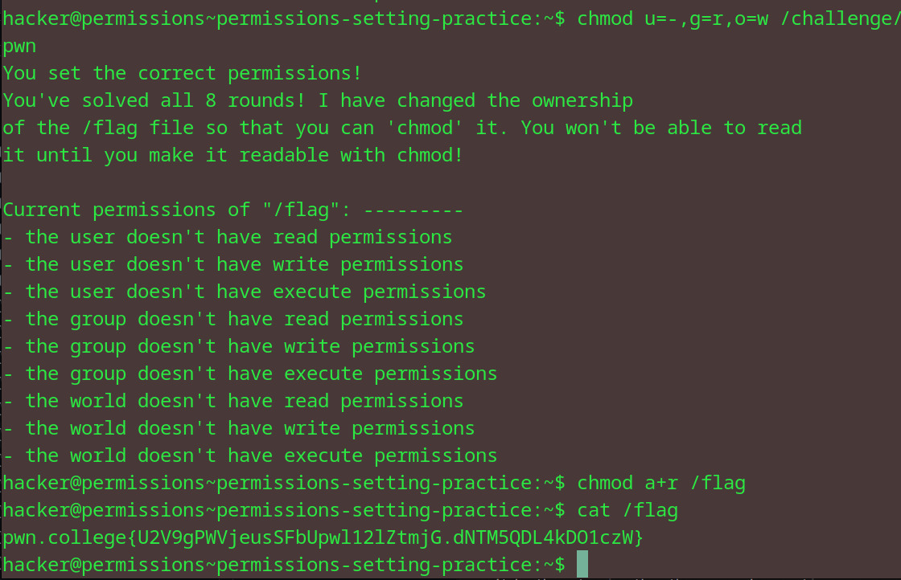

# Permission Setting Practice
## Question
In this challenge, you must retrieve the exit code returned by /challenge/get-code and then run /challenge/submit-code with that error code as an argument. Good luck!

## Solution

1. another 8 rounds of chmod to finally get the final file
2. use a+r to make it readable and cat the file

flag: pwn.college{U2V9gPWVjeusSFbUpwl12lZtmjG.dNTM5QDL4kDO1czW}
