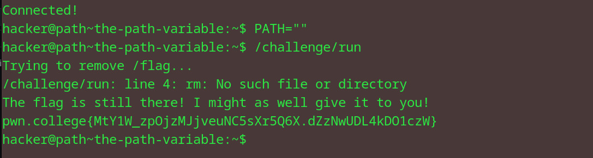

# The PATH Variable
## Question
In this level, you will disrupt the operation of the /challenge/run program. This program will DELETE the flag file using the rm command. However, if it can't find the rm command, the flag will not be deleted, and the challenge will give it to you! Thus, you must make it so that /challenge/run also can't find the rm command!

## Solution

1. set path to blank (so bash cannot find the cmd)
2. flag cannot be removed as path has been blank-ed
3. flag obtained

pwn.college{MtY1W_zpOjzMJjveuNC5sXr5Q6X.dZzNwUDL4kDO1czW}

