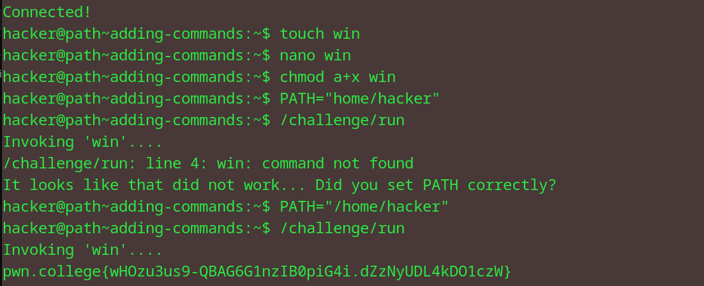

# Adding Commands
## Question
reviously, the win command that /challenge/run executed was stored in /challenge/more_commands. This time, win does not exist! Recall the final level of Chaining Commands, and make a shell script called win, add its location to the PATH, and enable /challenge/run to find it!

## Solution

1. created a new shell script and used nano to write the following in it:
``` bash
read flag < /flag 
echo "$flag"
```
2. chmod the file to make it executable by all
3. set the path to /home/hacker which is the location of the file created
4. run the /challenge/run cmd to get the flag

flag: pwn.college{wHOzu3us9-QBAG6G1nzIB0piG4i.dZzNyUDL4kDO1czW}


