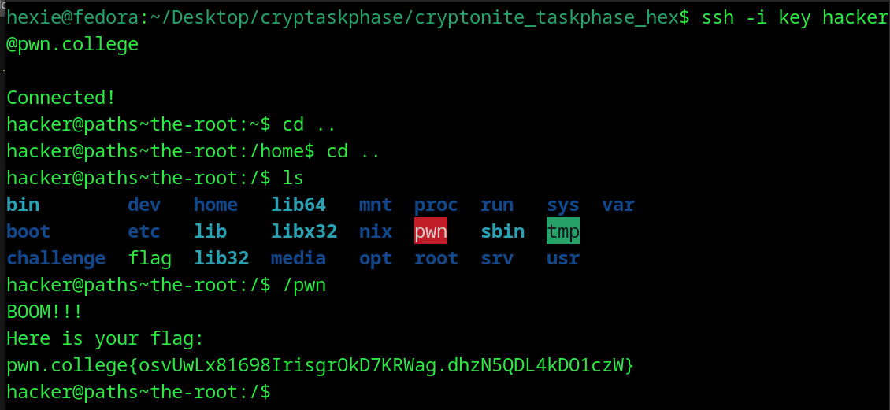

# TheRoot
## Question
Start the challenge, launch a terminal, invoke the pwn program using its absolute path, and Capture that Flag! Good luck!

## Solution

1. moved to / folder
2. followed instructions to open the pwn directory

flag: pwn.college{osvUwLx81698IrisgrOkD7KRWag.dhzN5QDL4kDO1czW}

