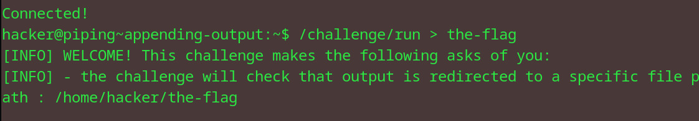
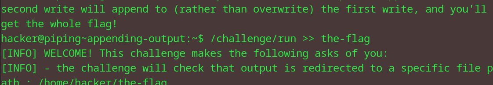
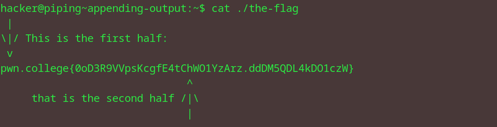

# Appending output
## Question
To practice, run /challenge/run with an append-mode redirect of the output to the file /home/hacker/the-flag. The practice will write the first half of the flag to the file, and the second half to stdout if stdout is redirected to the file. If you properly redirect in append-mode, the second half will be appended to the first, but if you redirect in truncation mode (>), the second half will overwrite the first and you won't get the flag!

## Solution

1. redirected the command output to file name the-flag
2. did it again and used the append method over the overwrite one (two >'s)
3. looked into the flag file (from another dir so i used ./)

flag: pwn.college{0oD3R9VVpsKcgfE4tChWO1YzArz.ddDM5QDL4kDO1czW}
