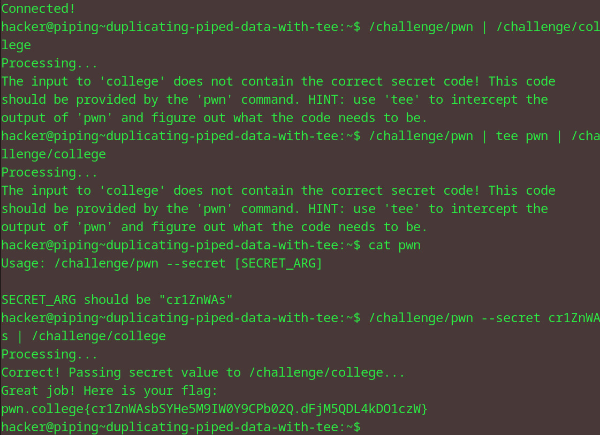

# Duplicating piped data with tee
## Question
Now, you try it! This process' /challenge/pwn must be piped into /challenge/college, but you'll need to intercept the data to see what pwn needs from you!

## Solution

1. piped the ./pwn to ./college but got an error message (told to use tee)
2. used tee pwn but didn't result in anything
3. concatenated pwn to get the usage of pwn and used it to get the secret arg
4. used the first input again but this time with the secret arg

flag: pwn.college{cr1ZnWAsbSYHe5M9IW0Y9CPb02Q.dFjM5QDL4kDO1czW}
