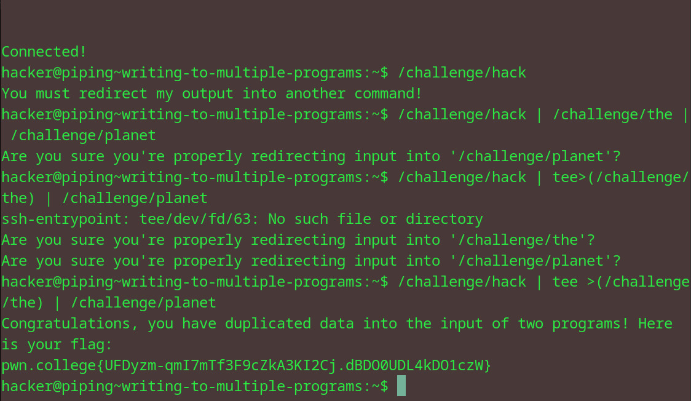

# Writing to multiple programs
## Question
Now it's your turn! In this challenge, we have /challenge/hack, /challenge/the, and /challenge/planet. Run the /challenge/hack command, and duplicate its output as input to both the /challenge/the and the /challenge/planet commands!

## Solution

1. had to experiment a bit so i just ran two piping commands first
2. then decided to use tee on the /challenge/the to duplicate its output into the planet cmd as well
3. got flag

flag: pwn.college{UFDyzm-qmI7mTf3F9cZkA3KI2Cj.dBDO0UDL4kDO1czW}
