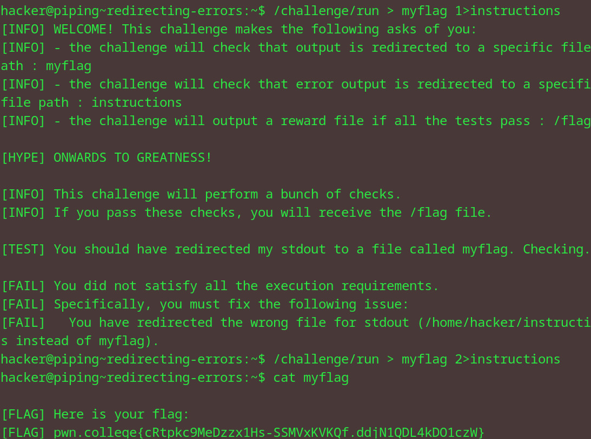

# Redirecting errors
## Question
Let's put this into practice! In this challenge, you will need to redirect the output of /challenge/run, like before, to myflag, and the "errors" (in our case, the instructions) to instructions. You'll notice that nothing will be printed to the terminal, because you have redirected everything! You can find the instructions/feedback in instructions and the flag in myflag when you successfully pull this off!

## Solution

1. accidentally used myflag 1 (which is for output, not errors if im not wrong)
2. changed argument to redir the output from the file to myflag 2
3. looked into the myflag file

flag: pwn.college{cRtpkc9MeDzzx1Hs-SSMVxKVKQf.ddjN1QDL4kDO1czW}
