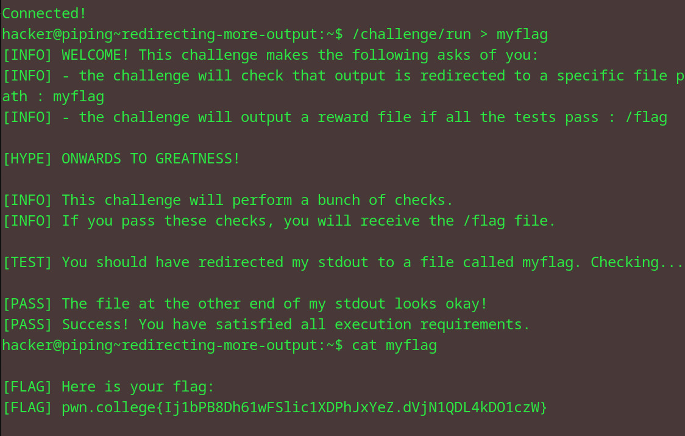

# Redirecting more output
## Question
Aside from redirecting the output of echo, you can, of course, redirect the output of any command. In this level, /challenge/run will once more give you a flag, but only if you redirect its output to the file myflag. Your flag will, of course, end up in the myflag file!

## Solution

1. redirected the command output to file name myflag
2. looked into the myflag file

flag: pwn.college{Ij1bPB8Dh61wFSlic1XDPhJxYeZ.dVjN1QDL4kDO1czW}
