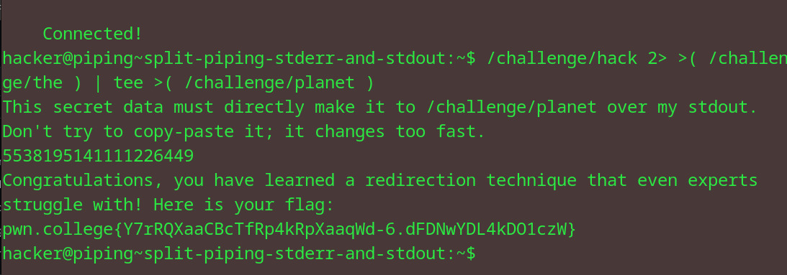

# Split-piping stderr and stdout
## Question
Now, let's put your knowledge together. You must master the ultimate piping task: redirect stdout to one program and stderr to another.

## Solution

1. used the file descriptors 1 and 2 (standard output and error)
2. redirected the challenge/hack error output into challenge/the and tee'd it into the planet cmd by using process substitution

flag: pwn.college{Y7rRQXaaCBcTfRp4kRpXaaqWd-6.dFDNwYDL4kDO1czW}
