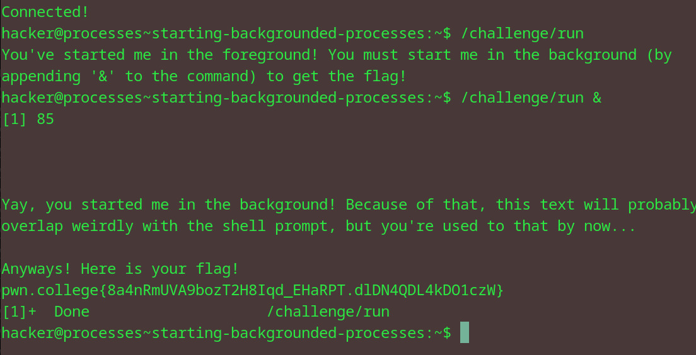

# Starting Background Processes
## Question
Here, sleep is actively running in the background, not suspended. Now it's your turn to practice! Launch /challenge/run backgrounded for the flag!

## Solution

followed the instructions given in the question

flag: pwn.college{8a4nRmUVA9bozT2H8Iqd_EHaRPT.dlDN4QDL4kDO1czW}
