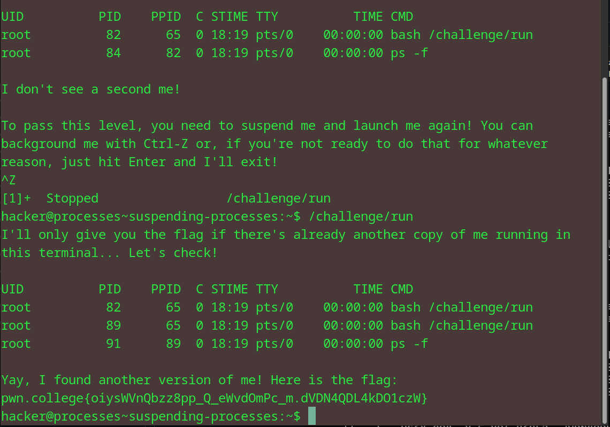

# Suspending Processes
## Question
This level's run wants to see another copy of itself running and using the same terminal. How? Use the terminal to launch it, then suspend it, then launch another copy while the first is suspended!

## Solution

followed the instructions given in the question

flag: pwn.college{oiysWVnQbzz8pp_Q_eWvdOmPc_m.dVDN4QDL4kDO1czW}
