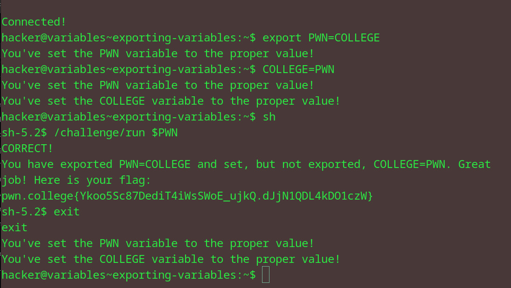

# Exporting Variables
## Question
In this challenge, you must invoke /challenge/run with the PWN variable exported and set to the value COLLEGE, and the COLLEGE variable set to the value PWN but not exported (e.g., not inherited by /challenge/run). Good luck!

## Solution

followed instructions from the question

flag: pwn.college{Ykoo5Sc87DediT4iWsSWoE_ujkQ.dJjN1QDL4kDO1czW}
