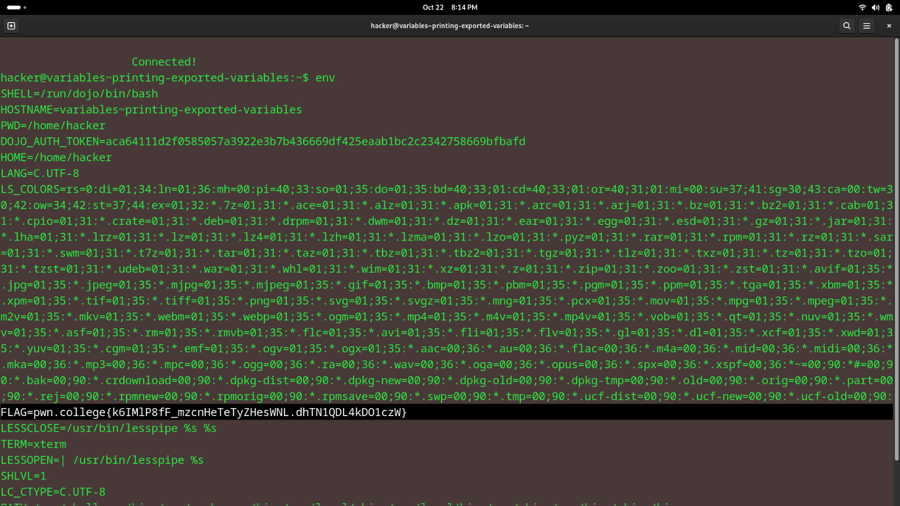

# Printing Exported Variables
## Question
Try the env command: it'll print out every exported variable set in your shell, and you can look through that output to find the FLAG variable!

## Solution

followed instructions from the question

flag: FLAG=pwn.college{k6IMlP8fF_mzcnHeTeTyZHesWNL.dhTN1QDL4kDO1czW}
