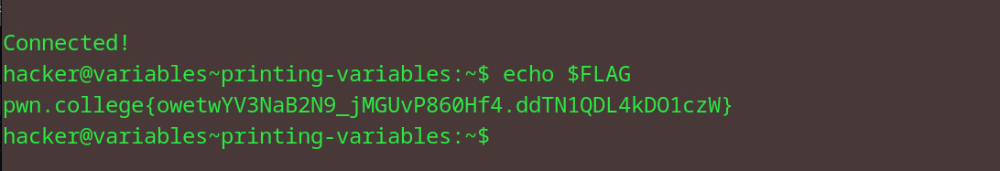

# Printing Variables
## Question
Now it's your turn. Have your shell print out the FLAG variable and solve this challenge!

## Solution

followed instructions from the question

flag: pwn.college{owetwYV3NaB2N9_jMGUvP860Hf4.ddTN1QDL4kDO1czW}
